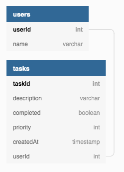

# Todo Application - Backend

This is the backend of My Todo List application, built throughout the [BBC's Step into Tech course](https://www.youtube.com/watch?v=iH5zl6iQYoo) with [Tech Returners](https://techreturners.com). 

It integrates with a frontend, available [here](https://github.com/dorarad17/todo-app-frontend).

The hosted version of the application is available here: [https://github.com/whatever-link-here](https://github.com/whatever-link-here).

### Technology Used

This project uses the following technology:

- Serverless Framework
- JavaScript (ES2015+)
- Express
- SQL
- Mysql library
- AWS Lambda and API Gateway
- AWS RDS
- ESLint

### Database schema



### Endpoints

The API exposes the following endpoints:

---

##### GET /tasks

[https://2oez8h7do2.execute-api.eu-west-2.amazonaws.com/dev/tasks](https://2oez8h7do2.execute-api.eu-west-2.amazonaws.com/dev/tasks)

Responds with JSON containing all tasks in the Database.

---

##### POST /tasks

[https://2oez8h7do2.execute-api.eu-west-2.amazonaws.com/dev/tasks](https://2oez8h7do2.execute-api.eu-west-2.amazonaws.com/dev/tasks)

Will create a new task when sent a JSON payload in the format:

```json
{
	"description" : "new task",
	"completed" : 0 ,
	"userId" : 364,
	"priority" : 3
}
```

---

##### DELETE /tasks/:taskId

[https://2oez8h7do2.execute-api.eu-west-2.amazonaws.com/dev/tasks/{taskId}](https://2oez8h7do2.execute-api.eu-west-2.amazonaws.com/dev/tasks/{taskId})

Deletes the task of the given ID.

---

##### PUT /tasks/:taskId

[https://2oez8h7do2.execute-api.eu-west-2.amazonaws.com/dev/tasks/{taskId}](https://2oez8h7do2.execute-api.eu-west-2.amazonaws.com/dev/tasks/{taskId})

Will update a task when sent a JSON payload in the format:

```json
{
	"description" : "updated description",
	"completed" : 1 ,
	"userId" : 364,
	"priority" : 1
}
```
